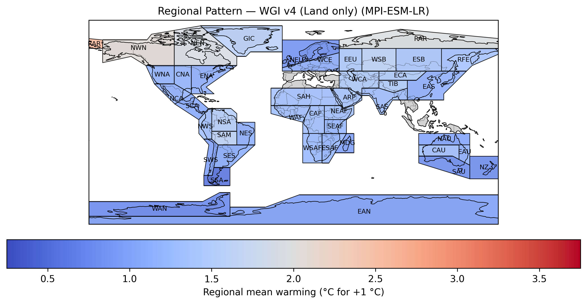

# Building Interpretable Climate Emulators for Economics

<p align="center">

</p>

## Note
The README is optimised to view in markdown (.md) format. In README.pdf some links may not work correctly.

## Description of programs and datasets used

### Organization of the repository

This Python-based code repository supplements the work of [Aryan Eftekhari](https://sites.google.com/view/eftekhari/?pli=1), [Doris Folini](https://iac.ethz.ch/people-iac/person-detail.NDY3MDg=.TGlzdC82MzcsLTE5NDE2NTk2NTg=.html), [Aleksandra Friedl](https://sites.google.com/view/aleksandrafriedl/home), [Felix Kuebler](https://sites.google.com/site/fkubler/), [Simon Scheidegger](https://sites.google.com/site/simonscheidegger), and [Olaf Schenk](https://search.usi.ch/en/people/9a52a2fdb8d3d26ec16fb1569b590909/schenk-olaf) titled _[Building Interpretable Climate Emulators for Economics](#citation)_ (Eftekhari et al.; 2025).

* This repository contains three distinct folders:
  1. ["data"](data): Raw data for *Section 3 - A Calibrated Climate Emulator*, and *Appendix A, B* of our article.
      - Its content and usage are detailed in the corresponding [README](data/README.md).

  2. ["DEQN"](DEQN): Replication codes for *Section 4 - Numerical Experiments*, where non-stationary integrated assessment models (IAMs) are solved by adopting ["Deep Equilibrium Nets (DEQN)"](https://onlinelibrary.wiley.com/doi/epdf/10.1111/iere.12575) to the context of climate economic models.
      - How to reproduce the model solutions from scratch as well as the content and postprocessing of the pretrained solutions is detailed in the readme that provided under the following link: [README](DEQN/README.md).
      
  3. ["figures_replication"](figures_replication): Replication routines for plotting all the figures that are presented in the paper.
     - Its content and usage are detailed in the corresponding [README](figures_replication/README.md).

  
### Replication of the numerical results

* To replicate the results of the article step-by-step, a detailed set of instructions is provided _[here](#Replication)_.
  

### Datasets used

* The detailed references to the datasets used in our work are provided _[here](#Datasets)_.

### Statement about Rights

We certify that the authors of the manuscript have legitimate access to and permission to use the data used in this manuscript. 

### Summary of Availability

All data **are** publicly available. The description and the links to  the datasets can be found _[here](#Datasets)_. 

## Datasets

We use various datasets as input to our computations, all of which are briefly explained below. Furthermore, we provide the relevant URLs, and include them in this repository for convenience. 
The relevant references to the datasets we are using are Meinshausen et al. (2011), Taylor et al. (2012), Gasser et al. (2020), Joos et al. (2013), Jones et al. (2019), Macdougall et al. (2020), Lynch et al. (2017), Kravitz et al. (2017), Iturbide et al. (2020):
 
```
@article{taylor-et-al:12,
    author = {{Taylor}, Karl~E. and {Stouffer}, Ronald~J. and {Meehl}, Gerald~A.},
    title = "{An Overview of CMIP5 and the Experiment Design}",
    journal = {Bull. Amer. Meteor. Soc.},
    year = 2012,
    volume = 93,
    pages = {485-498},
    doi = {10.1175/BAMS-D-11-00094.1}
}

@article{meinshausen-et-al:11,
    author = {{Meinshausen}, Malte and {Smith}, S.~J. and {Calvin}, K. and {Daniel}, J.~S. and {Kainuma}, M.~L.~T. and {Lamarque}, J. -F. and {Matsumoto}, K. and {Montzka}, S.~A. and {Raper}, S.~C.~B. and {Riahi}, K. and {Thomson}, A. and {Velders}, G.~J.~M. and {van Vuuren}, D.~P.~P.},
    title = "{The RCP greenhouse gas concentrations and their extensions from 1765 to 2300}",
    journal = {Climatic Change},
    year = 2011,
    month = nov,
    volume = {109},
    number = {1-2},
    pages = {213-241},
    doi = {10.1007/s10584-011-0156-z},
    adsurl = {https://ui.adsabs.harvard.edu/abs/2011ClCh..109..213M},
    adsnote = {Provided by the SAO/NASA Astrophysics Data System}
}

@article{gasser2020historical,
    title={Historical CO 2 emissions from land use and land cover change and their uncertainty},
    author={Gasser, Thomas and Crepin, L{\'e}a and Quilcaille, Yann and Houghton, Richard A and Ciais, Philippe and Obersteiner, Michael},
    journal={Biogeosciences},
    volume={17},
    number={15},
    pages={4075--4101},
    year={2020},
    publisher={Copernicus Publications G{\"o}ttingen, Germany}
}

@article{joos2013carbon,
    title={Carbon dioxide and climate impulse response functions for the computation of greenhouse gas metrics: a multi-model analysis},
    author={Joos, Fortunat and Roth, Raphael and Fuglestvedt, Jan S and Peters, Glen P and Enting, Ian G and Von Bloh, Werner and Brovkin, Victor and Burke, Eleanor J and Eby, Michael and Edwards, Neil R and others},
    journal={Atmospheric Chemistry and Physics},
    volume={13},
    number={5},
    pages={2793--2825},
    year={2013},
    publisher={Copernicus GmbH}
}

@article{jones2019zero,
    title={The Zero Emissions Commitment Model Intercomparison Project (ZECMIP) contribution to C4MIP: quantifying committed climate changes following zero carbon emissions},
    author={Jones, Chris D and Fr{\"o}licher, Thomas L and Koven, Charles and MacDougall, Andrew H and Matthews, H Damon and Zickfeld, Kirsten and Rogelj, Joeri and Tokarska, Katarzyna B and Gillett, Nathan P and Ilyina, Tatiana and others},
    journal={Geoscientific Model Development},
    volume={12},
    number={10},
    pages={4375--4385},
    year={2019},
    publisher={Copernicus GmbH}
}

@article{macdougall2020there,
    title={Is there warming in the pipeline? A multi-model analysis of the Zero Emissions Commitment from CO 2},
    author={MacDougall, Andrew H and Fr{\"o}licher, Thomas L and Jones, Chris D and Rogelj, Joeri and Matthews, H Damon and Zickfeld, Kirsten and Arora, Vivek K and Barrett, Noah J and Brovkin, Victor and Burger, Friedrich A and others},
    journal={Biogeosciences},
    volume={17},
    number={11},
    pages={2987--3016},
    year={2020},
    publisher={Copernicus Publications G{\"o}ttingen, Germany}
}

@article{lynch2017open,
  title={An open-access CMIP5 pattern library for temperature and precipitation: description and methodology},
  author={Lynch, Cary and Hartin, Corinne and Bond-Lamberty, Ben and Kravitz, Ben},
  journal={Earth System Science Data},
  volume={9},
  number={1},
  pages={281--292},
  year={2017},
  publisher={Copernicus GmbH}
}

@article{kravitz2017exploring,
  title={Exploring precipitation pattern scaling methodologies and robustness among CMIP5 models},
  author={Kravitz, Ben and Lynch, Cary and Hartin, Corinne and Bond-Lamberty, Ben},
  journal={Geoscientific Model Development},
  volume={10},
  number={5},
  pages={1889--1902},
  year={2017},
  publisher={Copernicus GmbH}
}

@article{iturbide2020update,
  title={An update of IPCC climate reference regions for subcontinental analysis of climate model data: definition and aggregated datasets},
  author={Iturbide, Maialen and Guti{\'e}rrez, Jos{\'e} M and Alves, Lincoln M and Bedia, Joaqu{\'\i}n and Cerezo-Mota, Ruth and Cimadevilla, Ezequiel and Cofi{\~n}o, Antonio S and Di Luca, Alejandro and Faria, Sergio Henrique and Gorodetskaya, Irina V and others},
  journal={Earth System Science Data},
  volume={12},
  number={4},
  pages={2959--2970},
  year={2020},
  publisher={Copernicus Publications G{\"o}ttingen, Germany}
}
``` 

 
### CMIP5 output data for Climate Emulator testing

Please note that the data described below is added to the data [folder](data/source) as source data as well as parts of it are split across different subfolders [concentration](data/concentration), [emission](data/emission), [forcing](data/forcing), [tempearture](data/temperature). Thus we do not describe each folder spearately, but just the source data.

For the calibration of the CE we use the benchmark data that was added to [this folder](data/source/DataFromCMIP).

The data are based on montly mean global mean surface temperature data from the CMIP5 archive, as downloaded on March 1, 2021, from http://iacweb.ethz.ch/staff/beyerleu/cmip5/. The site offers an easy to use mirror to the full CMIP5 archive at https://esgf-node.llnl.gov/search/cmip5/.

The monthly mean data have been aggregated to annual means using cdo (climate data operators, https://code.mpimet.mpg.de/projects/cdo/).
The data comes in netcdf format. 


### CMIP5 input data, historical and RCPs

We used carbon emissions (GtC, fossile, other, total) and concentrations (CO2) as used in CMIP5 historical and RCP scenarios (see Taylor et al. (2012)). 

The data from Taylor et al. (2012) can be downloaded from the Potsdam Institute for Climate Impact Reasearch from following [URL](http://www.pik-potsdam.de/~mmalte/rcps/). Note that RCP3PD at PIK corresponds to RCP26. Likewise RCP6 at PIK corresponds to RCP60.

The following files contain annual carbon emissions from 1750 to 2500 for the different RCPs:

- RCP26_EMISSIONS.csv
- RCP45_EMISSIONS.csv
- RCP60_EMISSIONS.csv
- RCP85_EMISSIONS.csv

The following files contain annual mean CO2 concentrations from 1750 to 2500 for the different RCPs:

- RCP26_MIDYR_CONC.DAT
- RCP45_MIDYR_CONC.DAT
- RCP60_MIDYR_CONC.DAT
- RCP85_MIDYR_CONC.DAT

For simplicity, we added these datasets to this [folder](data/source/EmiAndConcData).

Additionally we used the land emissions data from Gasser et al. (2020). 

The follwoing file contains the data on land emissions:
- Gasser_et_al_2020_best_guess.nc

The data can be downloaded from the International Institute for Applied Systems Analysis from following [URL](https://pure.iiasa.ac.at/id/eprint/17551/). We added these dataset to this [folder](data/land_emission).

### Pulse

We used pulse data from Joos et al. (2013). 

The following files contain pre-processed timeseries of all the models under PD:
- IRF_PD100_SMOOTHED_AFCUM.dat
- IRF_PD100_SMOOTHED_CO2.dat
- IRF_PD100_SMOOTHED_FABCUM.dat
- IRF_PD100_SMOOTHED_FASCUM.dat
- IRF_PD100_SMOOTHED_OHC.dat
- IRF_PD100_SMOOTHED_SSLR.dat
- IRF_PD100_SMOOTHED_T.dat

The following files contain pre-processed timeseries of all the models under PI:
- IRF_PI100_SMOOTHED_AFCUM.dat
- IRF_PI100_SMOOTHED_CO2.dat
- IRF_PI100_SMOOTHED_FABCUM.dat
- IRF_PI100_SMOOTHED_FASCUM.dat
- IRF_PI100_SMOOTHED_OHC.dat
- IRF_PI100_SMOOTHED_SSLR.dat
- IRF_PI100_SMOOTHED_T.dat

The data can be downloaded from the University Bern from following [URL](https://climatehomes.unibe.ch/~joos/IRF_Intercomparison/results.html). 

For simplicity, we added these datasets to this [folder](data/pulse).

### Zero Emission Commitment

We used ZEC data from Jones et al. (2019) and Macdougall et al. (2020). 

The description can be found at the University of Victoria page [URL](https://terra.seos.uvic.ca/ZECMIP/) and the data can be downloaded from the following [URL](https://terra.seos.uvic.ca/ZECMIP/Data/). 

The list of the files with the data can be found [here](data/ZEC/files.txt). 

For simplicity, we added these datasets to this [folder](data/ZEC).

### Pattern scaling data
For pattern scaling we used three datasets.

First, we used the **IPCC AR6 WGI v4 reference regions** from Iturbide et al. (2020). The data can be found in this [repository](https://github.com/SantanderMetGroup/ATLAS). 

Second, we used a **library of temperature and precipitation patterns** from this [repository](https://github.com/JGCRI/CMIP5_patterns/tree/master) from Lynch et al. (2017), Kravitz et al. (2016).

Third, we used **ERA5 data** for the global climate and weather. The data can be found at the page of Climate Data Store of Copernicus Climate Change Service [URL](https://cds.climate.copernicus.eu/datasets/reanalysis-era5-single-levels-monthly-means?tab=overview).

For simplicity, we added these datasets to the following folders: 
- [folder](figures_replication/figure_9)
    - tas_climmean_era5_1991-2020_g025.nc
    - tas_climmean_HadGEM2-ES_minus_era5_1991-2020_g025.nc
    - tas_climmean_MPI-ESM-LR_minus_era5_1991-2020_g025.nc
    
- [folder](figures_replication/figure_10)
    - IPCC-WGI-reference-regions-v4_coordinates.csv
      
- [folder](figures_replication/figure_11)
    - PATTERN_tas_ANN_HadGEM2-ES_rcp85.nc
    - PATTERN_tas_ANN_MPI-ESM-LR_rcp85.nc
      
- [folder](figures_replication/figure_12)
    - ipcc_regions.csv
    - PATTERN_tas_ANN_HadGEM2-ES_rcp85.nc
    - PATTERN_tas_ANN_MPI-ESM-LR_rcp85.nc
    - tas_climmean_era5_1991-2020_g025.nc

- [folder](figures_replication/figure_32) (IPCC AR6 WGI v4 reference regions data). The list of the files with the data can be found [here](figures_replication/figure_32/files.txt). 

    
## Computational requirements

### Software requirements

The basic dependencies are tensorflow==2.3, hydra-core >= 1.1 and tensorboard (for monitoring).
For a full set of dependencies see the environment.yaml. The materials have been run and validated on a Linux OS, and the instructions to replicate the results may require some alterations on Windows based systems.

* We provide implementations that use python >= 3.10.

* For the  The basic dependencies are [Tensorflow==2.x](https://www.tensorflow.org/), [hydra](https://hydra.cc/) and [Tensorboard](https://www.tensorflow.org/tensorboard) (for monitoring).

* The file ``requirements.txt`` lists the detailed dependencies. Please run "pip install -r requirements.txt" as the first step. See [here](https://pip.pypa.io/en/stable/user_guide/#ensuring-repeatability) for further instructions on creating and using the ``requirements.txt`` file.

* To be able to reproduce the plots it is necessary to have [Latex](https://www.latex-project.org/get/) installed.

### Docker image

To pull the pre-built Docker image use this command:

```bash
docker pull nuvolos/public:648167_building_emulators
```

### Controlled randomness

The random seed for the DEQN computations in *Section 4 - Numerical Experiments* is set at ``Building_Interpretable_Climate_Emulators_forEconomics/DEQN/config/config.yaml``, line 10.

The random seed for the claimte emulator calibration computations in *Section 3 - A Calibrated Climate Emulator* is set at ``Building_Interpretable_Climate_Emulators_forEconomics/figures_replication/figures_3-4_14-25/solver.py``, line 187.


### Memory and runtime requirements

* To solve one IAM model as discussed in *Section 4 - Numerical Experiments* until full convergence, it requires about 15 min on an ordinary laptop. All those models presented in the paper were solved using our [DEQN library](DEQN), which we ran on an 8-core Intel compute node on [https://nuvolos.cloud](https://nuvolos.cloud) with 64GB of RAM, and 100Gb of fast local storage (SSD).

* To calibrate the climate emulator for all necessary parametrisations and under PI and PD initial conditions as presented in *Section 3 - A Calibrated Climate Emulator* and reported in the [calibration results](Building_Interpretable_Climate_Emulators_forEconomics/figures_replication/figures_3-4_14-25/result) folder, it requires less than an hour on an ordinary laptop. All calibrations presented in the paper were solved using the [solver](Building_Interpretable_Climate_Emulators_forEconomics/figures_replication/figures_3-4_14-25/solver.py), which we ran on an 8-core Intel compute node on [https://nuvolos.cloud](https://nuvolos.cloud) with 64GB of RAM, and 100Gb of fast local storage (SSD).

* All the postprocessing codes (to produce the summary statistics, plots, and so forth) were run on an ordinary 4-core Intel-based laptop with Ubuntu version 18.04.5 LTS and consume typically few seconds to run.

* The approximate time needed to reproduce all the analyses for this paper on a standard (year 2025) desktop machine is 1-3 days of human time.


## Replication

* This section provides instructions on how to replicate the numerical results of the article. Note that in this readme, we only provide the basic steps to obtain the main results (e.g., for the multi-model mean of the CDICE model). Highly granular instructions on how to compute all the corner cases of the article are provided in readmes in the respective sub-folders.

* The optimal optimal order of running the computer code to replicate the results in article are as follows. 
  1. Run the instructions listed in the subsection ``1. Replication of Section 3: A Calibrated Climate Emulator``. This set of instructions will allow you to replicate the results of section 3 of the article. 
  2. Run the instructions listed in ``2. Replication of Section 4: Numerical Experiments``. This set of instructions will allow you to replicate the results of section 4 of the article. 
  3. Run the instructions listed in ``3. Replication of Section 5: Linking Global to Local Temperatures and Damages``. This set of instructions will allow you to replicate the results of section 5 of the article. 


### 1. Replication of Section 3: A Calibrated Climate Emulator

In this section, we provide the basic instructions on how to compute the results presented in section 3 of the article.

First, go to the following folder:

```
$ cd <PATH to the repository>Building_Interpretable_Climate_Emulators_forEconomics/figures_replication/figures_3-4_14-25
```
This folder contains Python scripts for building, fitting, and visualizing climate emulators based on the framework described in the paper. The workflow is designed for Integrated Assessment Model (IAM) practitioners to create interpretable and efficient carbon cycle emulators. 

To run the full pipeline:
```bash
$ sh run_all.sh
```

* More details are provided in this general [readme](figures_replication/README.md) and [this readme](figures_replication/figures_3-4_14-25/README.md) that is specific to the section 3.


### 2. Replication of Section 4: Numerical Experiments

In this section, we provide the basic instructions on how to compute the results presented in section 4 of the article.

First, go to the following folder:

```
$ cd <PATH to the repository>Building_Interpretable_Climate_Emulators_forEconomics/figures_replication/figures_5-8_26-31
```

First, make sure you are at the root directory of DEQN by changing path to the following sub-directory:

```
$ cd <PATH to the repository>Building_Interpretable_Climate_Emulators_forEconomics/DEQN
```

To start the computation from scratch, change the specifications in the config file (config/config.yaml) to the particular model of interest while leaving the other entries untouched. The following entries will have to be adjusted:

```
defaults:
  - constants: cdice
  - net: cdice
  - optimizer: cdice
  - run:  cdice
  - variables:  cdice


MODEL_NAME:  XXX
```
XXX stands for the specific name of the model, the list of the models is presented [here](DEQN/README.md) .

Thereafter, execute:

```
python run_deepnet.py
```

To analyze the the raw results for the particular model solved, you need to perform two steps:

```
$ export USE_CONFIG_FROM_RUN_DIR=$ cd export USE_CONFIG_FROM_RUN_DIR=<PATH_TO_THE_FOLDER>/Building_Interpretable_Climate_Emulators_forEconomics/DEQN/runs/<MODEL_FOLDER>

$ python post_process_XXX.py STARTING_POINT=LATEST hydra.run.dir=$USE_CONFIG_FROM_RUN_DIR

```
where XXX stands for the postprocessing routine specific to the model.

For examplem, the setting for solving the 3SR model calibrated under PI for optimal mitigation **cdice_3sr_pi_opt** model is the following: 

```
  - constants: cdice
  - net: cdice
  - optimizer: cdice
  - run:  cdice
  - variables: cdice

MODEL_NAME:  cdice_3sr_pi_opt
```

To analyze this model, you need to run the following:

```
 export USE_CONFIG_FROM_RUN_DIR=<PATH_TO_THE_FOLDER>/Building_Interpretable_Climate_Emulators_forEconomics/DEQN/runs/cdice_3sr_pi_opt/3sr_pi_opt

python post_process_3sr.py STARTING_POINT=LATEST hydra.run.dir=$USE_CONFIG_FROM_RUN_DIR
```

To replicate the remaining results for individual models discussed in *Section 4 - Numerical Experiments*, the instructions given [here](DEQN/README.md).

* More details on the replication of the figures are provided in [this readme](figures_replication/README.md).


### 3. Replication of Section 5: Linking Global to Local Temperatures and Damages

In this section, we provide the basic instructions on how to compute the results presented in section 3 of the article.

First, go to the following folder:

```
$ cd <PATH to the repository>Building_Interpretable_Climate_Emulators_forEconomics/figures_replication
```

Folders `figure_9`, `figure_10`, `figure_11`, `figure_12`, `figure_13` contain all the scripts and data for replication of respective figures.

* More details are provided in [this readme](figures_replication/README.md).


## Authors

* [Aryan Eftekhari](https://sites.google.com/view/eftekhari/?pli=1) (Universita della Svizzera italiana, Faculty of Informatics, and the University of Lausanne, Department of Economics)
* [Doris Folini](https://iac.ethz.ch/people-iac/person-detail.NDY3MDg=.TGlzdC82MzcsLTE5NDE2NTk2NTg=.html) (ETH Zuerich, Institute for Atmospheric and Climate Science)
* [Felix Kuebler](https://sites.google.com/site/fkubler/) (the University of Zuerich, Department for Banking and Finance, and Swiss Finance Institute)
* [Aleksandra Friedl](https://sites.google.com/view/aleksandrafriedl/home) (ifo Institute, and the University of Munich)
* [Simon Scheidegger](https://sites.google.com/site/simonscheidegger) (the University of Lausanne, Department of Economics)
* [Olaf Schenk](https://search.usi.ch/en/people/9a52a2fdb8d3d26ec16fb1569b590909/schenk-olaf) (Universita della Svizzera italiana, Faculty of Informatics)


## Citation

Please cite [Building Interpretable Climate Emulators for Economics](https://papers.ssrn.com/sol3/papers.cfm?abstract_id=5021835) in your publications if it helps your research:

```
@article{eftekhari2024building,
  title={Building interpretable climate emulators for economics},
  author={Eftekhari, Aryan and Folini, Doris and Friedl, Aleksandra and K{\"u}bler, Felix and Scheidegger, Simon and Schenk, Olaf},
  journal={arXiv preprint arXiv:2411.10768},
  year={2024}
}

```


## Support

This work was generously supported by grant from the [Swiss National Science Foundation](https://www.snf.ch) under project ID "Can economic policy mitigate climate change?".
